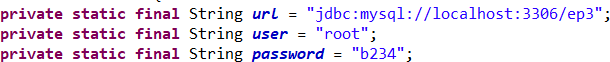

# Projeto Banco de Dados - Sistema de Mudanças

Este projeto foi desenvolvido para a criação de um banco de dados que gerencia as operações de empresas de mudanças, incluindo serviços, clientes, funcionários e pedidos. O objetivo principal é armazenar e organizar todas as informações necessárias para o bom funcionamento de um site que oferece serviços de mudança.

## Estrutura do Banco de Dados

O banco de dados foi projetado para armazenar informações sobre as seguintes entidades:

1. **Empresas**: Contém informações sobre as empresas de mudanças, como nome, endereço e telefone.
2. **Cidades**: Armazena as cidades nas quais as empresas oferecem seus serviços.
3. **Serviços**: Inclui os diferentes tipos de serviços que as empresas de mudanças oferecem, como transporte, embalagem, montagem, entre outros.
4. **Pedidos**: Registra os pedidos de serviços feitos pelos clientes, incluindo detalhes sobre o tipo de serviço, preços e status.
5. **Funcionários**: Armazena informações sobre os funcionários das empresas de mudanças, como nome, CPF, tipo de funcionário (motorista, guincho, etc.) e salário.
6. **Clientes**: Contém informações sobre os clientes que solicitam os serviços de mudança, incluindo nome, CPF, endereço e telefone.

Além disso, foram criadas tabelas para fazer a relação entre essas entidades, como a associação de empresas com cidades e serviços, e a relação de funcionários com os pedidos realizados.

## Consultas SQL

O banco de dados foi projetado para atender a várias consultas úteis, permitindo a análise de dados e o acompanhamento do desempenho das empresas de mudanças. As principais consultas incluem:

1. **Serviços solicitados por um cliente no último mês**
2. **Empresa que mais ofereceu serviços a uma cidade específica**
3. **Funcionários que trabalharam para um cliente em um mês específico**
4. **Solicitações feitas no último ano**
5. **Faturamento das empresas por mês**
6. **Serviço mais solicitado no último mês entre todas as empresas**
7. **Serviço mais solicitado por cada empresa**
8. **Cidade com o maior número de solicitações**
9. **Cidade de destino mais referenciada nos pedidos**
10. **Faturamento total por empresa**

## Triggers SQL

Além das consultas, o sistema também utiliza triggers para automatizar o gerenciamento de dados e manter a integridade dos registros. As triggers implementadas incluem:

1. **Manutenção do Preço do Pedido**: Uma trigger que atualiza automaticamente o preço total de um pedido, garantindo que ele esteja de acordo com o preço por hora do serviço oferecido pela empresa.

## Tecnologias Utilizadas

- **Banco de Dados**: MySQL
- **Linguagens de Programação**: Java (para o modelo DAO)
- **Ferramenta de Modelagem**: Miro (para o modelo ER)

## Como Executar a Aplicação

Para executar a aplicação, siga os passos abaixo. Este é o processo que utilizamos para rodar a aplicação localmente e pode ser útil para reproduzir o ambiente de desenvolvimento.

1. **Abrir o Projeto no Eclipse**
   - Abra a IDE Eclipse.
   - Crie ou abra uma workspace com a pasta do projeto.

2. **Configuração da Conexão com o Banco de Dados**
   - Dentro do projeto, localize a classe **`Conexao`**, que é responsável por fornecer a conexão com o banco de dados.
   - A conexão é realizada usando o driver JDBC para o MySQL.
   - O banco de dados estará no **mesmo computador** em que a aplicação está sendo executada.
   - Na classe `Conexao`, o usuário (**user**) e a senha (**password**) devem ser definidos conforme as credenciais configuradas no seu SGBD MySQL.
   


3. **Preparação do Banco de Dados**
   - Antes de executar a aplicação, certifique-se de que o banco de dados e as tabelas foram corretamente criados.
   - Execute os **scripts SQL** para a criação do banco de dados e das tabelas, assim como os **inserts de dados** especificados no relatório.
   - No MySQL, execute o comando: 
     ```sql
     USE ep3;
     ```
     Isso irá selecionar o banco de dados chamado `ep3` para uso.

4. **Executar a Aplicação**
   - Execute a classe **`App`**, que contém o método **`main`** e é responsável por iniciar a aplicação e rodar as interfaces gráficas.
   - A aplicação utiliza a biblioteca **Java Swing** para criar a interface gráfica.
   - Após a execução, a interface será exibida com as 10 opções de consultas disponíveis no **`JComboBox`**.
   
5. **Realizar Consultas**
   - Escolha uma das 10 opções de consultas disponíveis na interface.
   - Para algumas consultas, será necessário fornecer parâmetros de entrada. Preencha-os conforme solicitado.
   - Após preencher os campos, clique no botão **"Consultar"** para ver os resultados da consulta.

Com esses passos, a aplicação estará pronta para ser executada e as consultas podem ser feitas diretamente pela interface gráfica.


## Conclusão

Este projeto de banco de dados proporciona uma solução robusta para gerenciar informações de empresas de mudanças, serviços, clientes e funcionários. As consultas e triggers automatizam processos essenciais e garantem a integridade dos dados. Através deste sistema, é possível monitorar o desempenho das empresas, o faturamento e a eficiência dos serviços oferecidos aos clientes.

